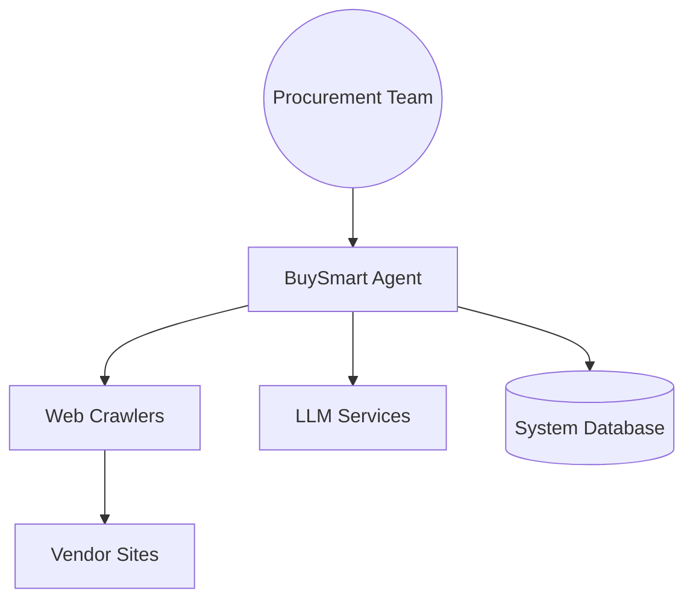

# System Architecture

## Context Map
The BuySmart Agent interacts with vendors, internal procurement teams, and various data sources.

## Containers
- **Frontend**: Dashboard for users to monitor agent activity.
- **Backend API**: Django-driven core logic and domain services.
- **Agent Workers**: Autonomous agents running specialized tasks.
- **Data Store**: Postgres + Redis.
